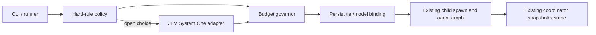

# PROJECT MAP: Strix Hybrid Router

> **Last Ground-Truth Audit:** 2026-10-07T03:32:00+07:00
> **Status:** Evidence complete; final commit and owner-fork push pending
> **Repository Root:** `/home/hieuit095/strix`
> **Architecture Stack:** Python 3.12+ CLI, asyncio agent graph, Docker sandbox, provider-backed LLMs

---

## 1. Task Compass (You Are Here)

- **Current Active Milestone:** Commit and publish the complete Task 00–08 evidence reconciliation; external Task 08 gates stay explicitly blocked.
- **Active Target Files:**
  - [tasks/README.md](file:///home/hieuit095/strix/tasks/README.md) - final per-task status table.
  - [tasks/00-baseline.md](file:///home/hieuit095/strix/tasks/00-baseline.md)–[tasks/08-live-rollout.md](file:///home/hieuit095/strix/tasks/08-live-rollout.md) - ordered acceptance evidence and explicit external gates.
  - [strix_hybrid_router_plan.md](file:///home/hieuit095/strix/strix_hybrid_router_plan.md) - §7 DoD reconciliation.
  - [docs/routing/verification.md](file:///home/hieuit095/strix/docs/routing/verification.md) - reproducible secret-free live/offline evidence.
  - [tests/test_routing_live.py](file:///home/hieuit095/strix/tests/test_routing_live.py) - opt-in envelope contract regression (commit 652e6d4).
- **Current Objective:** All requested implementation, tests, live comparisons, resume, documentation and task checklists are reconciled. Remaining are final secret/diff checks, a documentation commit and the authorized push to `origin` only.
- **Completed Milestones (verified):**
  - ✅ **2026-10-06:** Routing policy/governor, configuration, usage accounting, JEV adapter, spawn lifecycle, and snapshot/resume implementation committed on feat/hybrid-router.
  - ✅ **2026-10-06:** Namespace-aware policy/allowlist correction passed RED/GREEN and a real JEV-participating scan; evidence is recorded in Task 08 and routing verification docs.
  - ✅ **2026-10-07:** Current offline routing regression passed 234 tests (14 live-gated skips); full suite passed 2589 tests (14 skips, 3 xfails); make check-all passed Ruff, mypy, Pyright, and Bandit.
  - ✅ **2026-10-07:** Real JEV-enabled 3-run comparison and routed resume completed; resume exit 2/status completed with full recorded coverage, exact old child model and counters preserved.
  - ✅ **2026-10-07:** Task 00–08 checkboxes reconciled; Task 08 GPT entitlement, ground-truth/PoC and actual billing gates remain explicitly blocked.
- **Immediate Next Steps:**
  1. Run final diff/secret and target read-only checks; refresh the map’s post-commit status.
  2. Commit the task/documentation reconciliation separately from the envelope test commit.
  3. Push `feat/hybrid-router` only to the authorized owner fork; verify remote branch and clean worktree.

---

## 2. Executive Overview & Topology

Strix is an autonomous security testing CLI. The CLI builds a root agent and child-agent workflow; execution and coordinator state are persisted for scan resume. Hybrid routing chooses a child model through hard policy, JEV when a choice is open, and a share-cap governor before the existing spawn path starts the child.

### Entry Points & Key Packages

- **CLI:** [strix/interface/cli.py](file:///home/hieuit095/strix/strix/interface/cli.py) - argument parsing and runner invocation.
- **Runner:** [strix/core/runner.py](file:///home/hieuit095/strix/strix/core/runner.py) - scan lifecycle, root agent, routing setup, child closure.
- **Routing types/policy/governor/router:** [strix/routing/types.py](file:///home/hieuit095/strix/strix/routing/types.py), [strix/routing/policy.py](file:///home/hieuit095/strix/strix/routing/policy.py), [strix/routing/governor.py](file:///home/hieuit095/strix/strix/routing/governor.py), [strix/routing/router.py](file:///home/hieuit095/strix/strix/routing/router.py).
- **RunConfig and JEV adapter:** [strix/routing/runconfig.py](file:///home/hieuit095/strix/strix/routing/runconfig.py), [strix/routing/jev.py](file:///home/hieuit095/strix/strix/routing/jev.py).
- **Spawn/coordinator/resume:** [strix/core/execution.py](file:///home/hieuit095/strix/strix/core/execution.py), [strix/core/agents.py](file:///home/hieuit095/strix/strix/core/agents.py).
- **Verification tests:** [tests/test_routing_verification.py](file:///home/hieuit095/strix/tests/test_routing_verification.py), [tests/test_routing_live.py](file:///home/hieuit095/strix/tests/test_routing_live.py).

### State of Truth

- JEV wire contract is fixed to model `typesafe/jev`, endpoint `/systemone`, and choice question `route_tier`; only allowlisted skill labels and bounded metadata enter state.
- Worker, Specialist, Expert model bindings are DeepSeek, MiMo, and GPT respectively; exact configured IDs are documented in the routing verification report.
- Live scan estimates are usage-based estimates; the provider billing dashboard is not accessible from the current session.
- Provider credentials remain in the owner-protected file outside the repository. Never record values, request headers, raw request bodies, or raw provider responses.

---

## 3. Drift Audit Log

| Timestamp | Event | Root Cause | Reconciliation |
|---|---|---|---|
| 2026-10-07 02:00 ICT | Created map during final all-task audit | Navigator map was absent | Verified every mapped active path exists; final acceptance and commit status are recorded in the later audit entry |

| 2026-10-07 03:32 ICT | Completed Task 08 live comparison and resume; reconciled task 00–08 | Resume 5f2f completed exit 2 / coverage complete; three-run comparison recorded | Final remaining gates are external: GPT 403, no expected truth set, billing unread; no release authorization |
