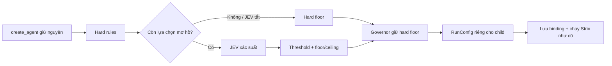

# Kế hoạch bổ sung multi-model + JEV cho Strix qua CommandCode

> **Nguyên tắc quyết định:** giữ nguyên toàn bộ sức mạnh và luồng làm việc của Strix. Chỉ thêm khả năng chọn model phù hợp cho agent bằng JEV; không biến việc này thành một cuộc viết lại kiến trúc.
> **Dành cho người triển khai:** dùng `executing-plans`, làm từng task có checkbox và kiểm chứng. Tài liệu này chưa phải yêu cầu triển khai mã.

**Mục tiêu:** root tiếp tục dùng model người dùng chọn; child có thể dùng worker, MiMo hoặc GPT qua cùng CommandCode API. JEV hỗ trợ chọn tier khi hard rules chưa quyết định được. Giữ nguyên tools, prompts, skills, scan modes, tạo agent, session, resume, budget và khả năng kiểm thử bảo mật của Strix.

**Kiến trúc:** tái dùng lõi `strix/routing/` đã có, thêm một HTTP adapter JEV và một helper nhỏ dựng RunConfig. Route một lần lúc spawn child; không đổi model giữa session. Tất cả model dùng cùng key/base/header CommandCode của cấu hình LLM hiện tại, không xây hệ thống nhà cung cấp mới.

**Công nghệ:** Python >=3.12, uv, OpenAI Agents SDK `>=0.19.0,<0.20`, LiteLLM `>=1.101.0`, pydantic-settings, pytest, httpx hiện có. Không thêm dependency.

**Đặc tả:** chính tài liệu này và ràng buộc người dùng: “Giữ nguyên toàn bộ sức mạnh của Strix”; chỉ cải tiến multi-model + JEV, tránh làm phình dự án. Khảo sát tại commit `55bc079`, ngày **05/10/2026**.

## 1. Phạm vi được chốt

### Làm trong lần nâng cấp này

1. Cấu hình worker/specialist/expert, dùng chung kết nối CommandCode.
2. Chọn model child bằng hard rules + JEV + governor hiện có sau khi sửa lỗi floor.
3. Truyền model đúng tới SDK usage hook.
4. Persist model binding và khôi phục đúng khi resume.
5. Mock tests, live contract smoke tùy chọn và tài liệu cấu hình.

### Không đưa vào lần nâng cấp này

- Không checkpoint đánh giá “stuck”, không lệnh stop do JEV, không giảm số turn/agent, không hạn chế tools hay coverage để tiết kiệm tiền.
- Không Advisor, ranking findings, Expected Value, rule “model bất đồng”, tự khám phá model hoặc router plugin.
- Không per-call ledger mới, không hệ thống telemetry/JSONL riêng, dashboard hay calibration framework.
- Không endpoint/key/header riêng từng tier, không trộn Chat/Responses/Anthropic trong v1.
- Không refactor dedupe, tool API, prompt, scan engine hoặc SDK để phục vụ phần có thể làm bằng RunConfig.

Đổi model không bảo đảm chất lượng pentest tương đương. Vì vậy không thêm cơ chế cắt ngắn công việc và phải so coverage/PoC thực khi rollout, không dùng “ít token hơn” làm tiêu chí duy nhất.

## 2. Phân tích mã hiện có

### 2.1 Trạng thái thực tế

`strix/routing/{__init__,types,policy,governor,router}.py` và bốn file `tests/test_routing_{types,policy,governor,router}.py` đã tồn tại nhưng chưa được Git theo dõi. Giữ lại công việc này, không viết lại từ đầu.

Đã chạy:

```bash
uv run pytest tests/test_routing_types.py tests/test_routing_policy.py tests/test_routing_governor.py tests/test_routing_router.py -q
# 26 passed
uv run pytest tests/test_routing_types.py tests/test_routing_policy.py tests/test_routing_governor.py tests/test_routing_router.py tests/test_dedupe_model.py tests/test_cost_tracking.py tests/test_pricing.py -q
# 63 passed, 2 Pydantic warnings về ReadOnly
```

Có 111 file `test_*.py`. Chưa chạy full suite/`make check-all` trong lần viết tài liệu. Chưa có RoutingSettings hoặc JEV adapter và router chưa được nối vào runner. Chưa gọi inference tính phí hay kiểm tra account CommandCode.

### 2.2 Điểm nối tối thiểu

| Mã đã đọc | Hiện trạng | Thay đổi cần thiết |
|---|---|---|
| [runner.py](/home/hieuit095/strix/strix/core/runner.py:371) | Dựng một RunConfig cho mọi agent; closure spawn L506 | Tạo router một lần/scan; chọn RunConfig trước spawn child |
| [execution.py](/home/hieuit095/strix/strix/core/execution.py:343) | Spawn register metadata rồi start runner; respawn L407 dùng RunConfig chính | Lưu binding khi register; chọn lại RunConfig từ binding lúc resume |
| [execution.py](/home/hieuit095/strix/strix/core/execution.py:1108) | Child context sao chép parent_ctx | Đặt lại model context của child theo RunConfig thực |
| [hooks.py](/home/hieuit095/strix/strix/core/hooks.py:302) | `on_llm_end` luôn ghi `self._model` | Dùng model context; fallback giá trị cũ khi thiếu |
| [models.py](/home/hieuit095/strix/strix/config/models.py:500) | StrixProvider hỗ trợ native OpenAI gateway; `openai/` đầu bị bỏ một lần | Dùng đúng prefix; tái dùng provider, không thêm provider mới |
| [inputs.py](/home/hieuit095/strix/strix/core/inputs.py:244) | Đã có `make_model_settings(...)` | Dựng settings theo tên tier, giữ mọi lựa chọn LLM hiện có |
| [agents.py](/home/hieuit095/strix/strix/core/agents.py:249) | Metadata task/skills; snapshot/restore giữ metadata | Thêm binding không secret; không tạo persistence riêng |
| [settings.py](/home/hieuit095/strix/strix/config/settings.py), [loader.py](/home/hieuit095/strix/strix/config/loader.py) | Settings lồng, env > JSON > defaults | Thêm RoutingSettings; tái dùng loader |
| [compaction.py](/home/hieuit095/strix/strix/llm/compaction.py:302) | Summary nhận model child nhưng dùng provider/header chính | Trong v1 cùng gateway/credential/header nên vẫn đúng; không cần sửa compaction |
| [usage.py](/home/hieuit095/strix/strix/report/usage.py), [pricing.py](/home/hieuit095/strix/strix/report/pricing.py) | Có usage ledger và estimator LiteLLM; cost theo agent phân bổ theo token | Tái dùng; ghi đúng model, nêu giới hạn giá/cost, không viết ledger mới |

### 2.3 Lỗi phải sửa trong phần routing đã có

Tái hiện bằng fake client trả `{worker:0, specialist:0.1, expert:0.9}`: gọi route `rce` ba lần cho kết quả **EXPERT → SPECIALIST → WORKER**. Governor đã hạ thấp hơn specialist floor của hard rules. 26 test hiện có chưa bắt trường hợp này.

`specialist_cap=0.25`, `expert_cap=0.05` hiện là tỷ lệ **quyết định**, không phải phần trăm tiền/token. Giữ governor nhỏ hiện có, sửa floor; không dùng tên “budget governor” để hứa kiểm soát 5% chi phí.

Tool-schema flags đang tính từ main model trong runner, dùng chung factory. V1 kiểm tra các tier có cùng flags và hỗ trợ wire đang dùng. Nếu khác, báo cấu hình không tương thích; không giảm tools, bỏ strict tùy tiện hoặc sửa factory lớn để vượt qua.

## 3. CommandCode API: thông tin đã xác minh

### 3.1 Nguồn chính thức

- [Provider API](https://commandcode.ai/docs/provider): endpoints/auth/usage, decision model và lỗi.
- [Catalog JSON trực tiếp](https://api.commandcode.ai/provider/v1/models), [Available Models](https://commandcode.ai/docs/reference/cli/models): exact IDs và supported_endpoints.
- [Pricing & Limits](https://commandcode.ai/docs/resources/pricing-limits): giá input/output/cache có điều kiện thời điểm.
- [ZDR](https://commandcode.ai/docs/resources/zdr): chính sách zero data retention.
- [TypeSafe API](https://docs.typesafe.ai/api), [Choice](https://docs.typesafe.ai/primitives/choice), [Confidence](https://docs.typesafe.ai/confidence): hợp đồng System One và ý nghĩa xác suất.

Không dùng hướng dẫn BYOK của CLI CommandCode làm tài liệu Provider API: đó là chiều tích hợp khác.

### 3.2 Kết nối và tên model

Base OpenAI client là `https://api.commandcode.ai/provider/v1`, auth `Authorization: Bearer <CMD_API_KEY>`. Chọn Chat Completions cho cả ba tier. JEV gọi POST `/systemone`, model `typesafe/jev`, không streaming. Các API khác được gateway hỗ trợ nhưng không cần tích hợp trong v1. Go không có API access. Nguồn: [Provider API](https://commandcode.ai/docs/provider).

Snapshot từ [catalog](https://api.commandcode.ai/provider/v1/models), đối chiếu [Available Models](https://commandcode.ai/docs/reference/cli/models):

| Vai trò | Cấu hình Strix | `model` gửi gateway |
|---|---|---|
| Worker/root | `openai/deepseek/deepseek-v4.1-flash` | `deepseek/deepseek-v4.1-flash` |
| Specialist | `openai/xiaomi/mimo-v2.6-pro` | `xiaomi/mimo-v2.6-pro` |
| Expert | `openai/gpt-6.1-sol` | `gpt-6.1-sol` |
| Decision | JEV adapter riêng | `typesafe/jev` |

Ba model văn bản có `/chat/completions` và `/responses` trong catalog ngày khảo sát. Kiểm tra local với fake key xác nhận `StrixProvider` trả `OpenAIChatCompletionsModel` và đúng wire IDs ở bảng. Đây chưa phải kiểm chứng upstream tool/reasoning.

Prefix `openai/` đầu chỉ chọn native SDK gateway; không thay tên hãng làm model. Không dùng `openrouter/...` khi endpoint là CommandCode, không gửi prefix route đó lên wire. `STRIX_API_TYPE=chat_completions` được đặt rõ để tránh suy API type theo catalog LiteLLM.

### 3.3 Hợp đồng JEV dùng trong dự án

Dùng question `choice` với nhãn `worker|specialist|expert`. Chọn theo `probabilities`, không dùng `confidence` thay xác suất nhãn. Schema theo [TypeSafe API](https://docs.typesafe.ai/api), [Choice](https://docs.typesafe.ai/primitives/choice) và [Confidence](https://docs.typesafe.ai/confidence); gateway mapping theo [Provider API](https://commandcode.ai/docs/provider).

Request dưới đây là **thiết kế dự án**, chưa phải request live đã chạy:

```json
{
  "model": "typesafe/jev",
  "state": "{\"skills\":[\"business_logic\"],\"attempts\":0,\"severity\":null,\"task_length_bucket\":\"short\"}",
  "questions": {
    "route_tier": {
      "type": "choice",
      "instructions": "Choose the minimum reasoning tier needed for this security task from the supplied metadata. A skill label alone is not evidence of a vulnerability.",
      "criteria": {
        "worker": "Routine discovery, known checks, or execution of an existing plan.",
        "specialist": "Multi-step exploit planning, authorization relationships, or uncertain business logic.",
        "expert": "Difficult reasoning across several conditions or complex high-impact exploit chains."
      }
    }
  }
}
```

Fixture tự dựng theo schema, số chỉ minh họa:

```json
{
  "model": "typesafe/jev",
  "answers": {
    "route_tier": {
      "type": "choice",
      "choice": "specialist",
      "confidence": 0.70,
      "probabilities": {"worker": 0.10, "specialist": 0.80, "expert": 0.10}
    }
  },
  "usage": {"input_tokens": 180, "output_tokens": 3}
}
```

Parser phải kiểm tra đúng question/type; ba labels đúng và đầy đủ; probability/confidence hữu hạn trong [0,1], không bool; tổng xác suất sai không quá 0.01; usage token nguyên không âm. Không normalize JSON sai, không thay nhãn thiếu bằng 0. Cho phép field bổ sung top-level. State dùng string JSON để khớp dạng gateway đã minh họa.

Timeout dự án 5 giây; một request/decision, không retry JEV trong routing loop. HTTP error/timeout/parse error → hard floor; cancellation truyền lên. Không áp giới hạn RPM/TPM bịa cho tài khoản. Auth/API/model access cần live smoke xác nhận.

### 3.4 Dữ liệu JEV và ZDR

JEV hiện bị từ chối khi gửi `x-cmd-zdr: 1`; không âm thầm gỡ header để gọi lại. Model sinh văn bản và JEV có chính sách khác nhau. Xem [Provider API](https://commandcode.ai/docs/provider) và [ZDR](https://commandcode.ai/docs/resources/zdr).

Mặc định JEV tắt. Khi bật, chỉ gửi allowlist: skills có trong policy, attempts, severity enum, bucket độ dài task (`short<=256`, `medium<=2048`, `long>2048`). Không gửi task thô, URL, hostname, code, notes, findings, tool outputs, credential, hash hoặc chuỗi skill tùy ý. Metadata này hạn chế khả năng phân loại của JEV; không quảng bá nó là đánh giá sâu exploit.

Nếu policy/cấu hình yêu cầu ZDR cho mọi request, dùng floor-only, JEV không được gọi. JEV dùng key main chỉ khi main base đúng CommandCode; không tự tìm key trong config CLI. Không dump Settings, raw error body hoặc Authorization vào logs. Đây là ràng buộc cho adapter mới, không thay đổi phạm vi dữ liệu Strix vốn gửi model chính.

### 3.5 Chi phí: giữ cơ chế sẵn có, không mở rộng thành dự án riêng

Giá snapshot USD/1M token, cần kiểm tra lại trước rollout: [Pricing & Limits](https://commandcode.ai/docs/resources/pricing-limits).

| Model | Input mới | Output | Cache read |
|---|---:|---:|---:|
| DeepSeek V4.1 Flash | 0.15 ngoài cao điểm / 0.30 cao điểm | 0.60 / 1.20 | 0.003 |
| MiMo V2.6 Pro | 0.435 | 0.87 | 0.0036 |
| GPT-6.1 Sol | 2.00 | 10.00 | 0.10 |
| Jev | 0.042 | 0 | 0 |

Chỉ sửa hook để ghi đúng model, đưa JEV usage vào `record_sdk_usage` hiện có. LiteLLM estimator có thể thiếu IDs mới hoặc khác giá gateway; phần tiền theo agent đang phân bổ theo token, không phải billing chính xác mỗi model. `--max-budget` vẫn là guard hiện có, không biến thành cam kết charge CommandCode hoặc hard cap với request concurrent.

Trước live rollout có budget, xác nhận estimator định giá được các IDs đã chọn. Nếu không: bổ sung giá qua `litellm.register_model` hiện có bằng bảng giá được operator kiểm tra, chỉ khi cần; không viết pricing engine/ledger mới và không báo $0 là miễn phí. Nếu chưa xác minh được giá thì chưa vượt gate live có budget. JEV rate cũng cần kiểm tra; summary accounting có hạn chế tồn tại trước nâng cấp, không đánh đồng báo cáo Strix với hóa đơn gateway.

## 4. Thiết kế tối thiểu

### 4.1 Luồng chọn model



Root không route: giữ model resolved từ tham số `model=` hoặc `STRIX_LLM`. Chọn model child một lần; nested child chọn từ task/skills mới, không lấy tier cha làm mặc định. Không hỏi JEV theo mỗi turn. Không thay đổi quyền/tools/prompt/scan mode theo tier.

Giữ policy dữ liệu hiện có:

```python
HIGH_IMPACT = frozenset({"rce", "ssrf", "authentication_jwt",
    "insecure_deserialization", "broken_function_level_authorization",
    "http_request_smuggling"})
AMBIGUOUS = frozenset({"business_logic", "race_conditions", "idor",
    "mass_assignment", "semantic_confusion"})
```

Plain → worker; ambiguous → worker..specialist; high-impact → specialist..expert; severity high/critical nâng floor specialist. Severity hiện không có trong spawn args: không đoán nó từ task. Nếu chỉ còn một tier trong khoảng thì không gọi JEV. Các nhóm skill là policy ban đầu, không khẳng định SQLi/XSS luôn đơn giản.

Expert đạt xác suất >=0.65 được ưu tiên, rồi specialist >=0.65; còn lại dùng floor. Clamp trước governor; governor không hạ dưới floor. Caps chỉ hạn chế nâng cấp tùy chọn, hard floor có thể vượt cap. Cap=0 tắt nâng cấp tùy chọn, không cấp “free first” expert.

Khi routing bật, specialist bắt buộc để đáp ứng floor; expert tùy chọn. Không cấu hình expert → ceiling specialist. Startup lỗi cấu hình phải báo rõ, không hạ high-impact xuống worker âm thầm.

### 4.2 Settings cần thêm

Gắn `RoutingSettings` vào Settings/export, dùng `_BASE_CONFIG`, aliases và loader hiện có.

| Field | Env | Default / validation |
|---|---|---|
| `enabled` | `STRIX_ROUTING_ENABLED` | False |
| `specialist_model` | `STRIX_ROUTING_SPECIALIST_MODEL` | None; strip rỗng→None |
| `expert_model` | `STRIX_ROUTING_EXPERT_MODEL` | None; strip rỗng→None |
| `jev_enabled` | `STRIX_ROUTING_JEV_ENABLED` | False |
| `jev_timeout_s` | `STRIX_ROUTING_JEV_TIMEOUT_S` | 5; finite >0 |
| `specialist_threshold` | `STRIX_ROUTING_SPECIALIST_THRESHOLD` | 0.65; finite 0<value<=1 |
| `expert_threshold` | `STRIX_ROUTING_EXPERT_THRESHOLD` | 0.65; finite 0<value<=1 |
| `specialist_cap` | `STRIX_ROUTING_SPECIALIST_CAP` | 0.25; finite 0<=value<=1 |
| `expert_cap` | `STRIX_ROUTING_EXPERT_CAP` | 0.05; finite 0<=value<=1 |

Worker/key/base/header/reasoning/timeout/prompt cache dùng LlmSettings hiện có. Không thêm credential tier hoặc JEV riêng. Chỉ khi routing bật mới validate yêu cầu specialist/cùng CommandCode/native Chat. Disabled không khởi tạo router/client hay gọi catalog.

### 4.3 Interfaces và số file mới

Chỉ **hai module production mới**: `strix/routing/jev.py`, `strix/routing/runconfig.py`. Mở rộng types/router/governor đang có; sửa các điểm wiring hiện có. Test mới là test hành vi, không scaffolding framework.

```python
# types.py — payload sử dụng trực tiếp ở router và kế toán JEV
@dataclass(frozen=True)
class DecisionResult:
    probabilities: dict[str, float]
    input_tokens: int
    output_tokens: int

# router.py — adapter/fake cùng contract
class DecisionClient(Protocol):
    async def decide(self, envelope: Envelope, question: str) -> DecisionResult: ...

# governor.py
BudgetGovernor.admit(tier: Tier, *, floor: Tier,
    available: frozenset[Tier]) -> Tier

# runconfig.py
run_config_for_model(base: RunConfig, model_name: str,
    settings: Settings) -> RunConfig
```

Helper worker trả chính base object. Model khác: `dataclasses.replace(base, model=model_name, model_settings=...)`, **giữ base.model_provider** vì kết nối giống nhau. `make_model_settings` truyền đúng sáu lựa chọn runner đang dùng: `reasoning_effort`, `model_name`, `force_required_tool_choice`, `request_timeout`, `prompt_cache`, `extra_headers`. Không tự tắt reasoning/required tools để gọi model dễ hơn; nếu upstream không tương thích thì sửa lựa chọn model/cấu hình sau smoke, không giảm chức năng Strix.

Model binding persist: `{version:1, tier, model, api_base, api_type}`; không credential/header. Metadata có binding trong cùng register trước spawn. Resume dùng exact saved model; Settings đổi binding thì báo mismatch, không gửi session cũ tới model mới. Snapshot cũ không binding giữ behavior cũ. Governor counts persist trong snapshot scan hiện có, không persistence riêng.

## 5. Các task có thể thực hiện trực tiếp

Mọi task tính năng: viết test → chạy thấy đỏ đúng lý do → sửa tối thiểu → chạy lại xanh → regression liên quan. Characterization hành vi đã có được xanh ngay; không ép đỏ giả. Không sửa test để che bug, không skip/xfail offline. Full suite/check-all ở milestone, không lặp sau mỗi chỉnh sửa nhỏ.

### Task 0 — Baseline

**Không sửa production.**

- [ ] `git status --short`, đọc AGENTS.md; giữ công việc untracked. Nếu bắt đầu implementation cần nhánh thì dùng `codex/hybrid-router-commandcode`.
- [ ] `make check-all` và `uv run pytest -q`; ghi số test/lỗi có sẵn. `make dev-install` chỉ nếu thiếu deps.
- [ ] Lấy 26 routing tests làm baseline hiện có, không viết lại types/policy.

**Cổng:** biết trạng thái thật repo. Không scan/network inference.

### Task 1 — Sửa floor, availability và floor-only

**Sửa:** `strix/routing/{types,governor,router}.py`; **test:** `tests/test_routing_{types,policy,governor,router}.py`.

- [ ] Thêm regression vào file router test có sẵn:

```python
async def test_repeated_high_impact_never_drops_below_floor() -> None:
    r = make(FakeClient({"worker": 0.0, "specialist": 0.1, "expert": 0.9}))
    decisions = [await r.route(e("rce")) for _ in range(3)]
    assert all(d.tier >= Tier.SPECIALIST for d in decisions)
```

- [ ] `uv run pytest tests/test_routing_router.py::test_repeated_high_impact_never_drops_below_floor -q` → hiện đỏ ở lần thứ ba.
- [ ] Sửa admit theo §4.1/4.3: không await giữa check và tăng counter, tăng một lần theo tier cuối; thiếu floor hợp lệ là ValueError, startup ngăn trường hợp này.
- [ ] Router nhận available tiers và `client=None` cho floor-only; chỉ hỏi JEV khi khoảng hợp lệ có >=2 tier. Chuyển fake/Protocol sang DecisionResult cùng task, giữ RouteDecision(tier, reason) nhỏ hiện có.
- [ ] Test cap=0, thiếu expert, sole-choice không JEV, threshold 0.65 inclusive, floor/ceiling, exception fallback, CancelledError không bị nuốt. Không cần thêm policy rules mới.
- [ ] Chạy bốn routing files → xanh.

**Cổng:** không chọn model thiếu, không phá floor; không nối runner trước khi core đúng.

### Task 2 — Settings và RunConfig helper

**Sửa:** `strix/config/{settings,__init__}.py`; **tạo:** `strix/routing/runconfig.py`, `tests/test_routing_settings.py`, `tests/test_routing_runconfig.py`.

- [ ] Đỏ Settings: default disabled, env/JSON có hiệu lực, NaN/out-of-range reject; main model override `model=` không bị mất. Thêm fields đúng §4.2, không loader mới.
- [ ] Đỏ helper: worker trả `is base`; specialist đổi model/settings mà base không mutate; **provider vẫn là base.model_provider**.
- [ ] Dựng model_settings theo runner §4.3, không copy worker settings rồi chỉ thay model name.
- [ ] Startup enabled: require specialist, CommandCode canonical base, `STRIX_API_TYPE=chat_completions`, native prefix; so `uses_chat_completions_tool_schema`/`supports_strict_tool_schemas` của tier và main. Không gọi catalog mỗi turn/spawn.
- [ ] MockTransport/native SDK fake client xác nhận ba model có exact wire ID/URL/bearer ở §3.2; main headers và settings vẫn được gửi.
- [ ] `uv run pytest tests/test_routing_settings.py tests/test_routing_runconfig.py tests/test_config_loader.py tests/test_models.py tests/test_llm_extra_headers.py -q` → xanh.

**Cổng:** dùng kết nối và settings sẵn có, không endpoint system mới, không thay tools/prompt.

### Task 3 — Usage model đúng theo context

**Sửa:** `strix/core/hooks.py`; **test:** `tests/test_cost_tracking.py`.

- [ ] Đỏ: `context.context["model"]="openai/xiaomi/mimo-v2.6-pro"` thì `record_sdk_usage` nhận đúng model; thiếu key vẫn dùng self._model.
- [ ] Thêm `MODEL_KEY="model"` cạnh LLM_TURN_KEY. Chỉ chấp nhận nonempty string, không lấy object tùy ý từ context.
- [ ] Thay duy nhất model lookup tại hook; không refactor report ledger/pricing/report format.
- [ ] `uv run pytest tests/test_cost_tracking.py tests/test_budget_pause_policy.py tests/test_e2e_budget_lifecycle.py tests/test_pricing.py -q` → xanh.

**Cổng:** usage theo model không ghi nhầm worker; budget semantics hiện có giữ nguyên. Billing limits được ghi rõ §3.5.

### Task 4 — JEV adapter thật bằng httpx, dùng chung key

**Tạo:** `strix/routing/jev.py`, `tests/test_routing_jev.py`; **sửa:** router chỉ khi cần nối return type đã chốt.

- [ ] Đỏ MockTransport: fixture §3.3 → DecisionResult đúng; request path/model/auth/state string đúng. `JevClient` nhận AsyncClient/base/key/timeout từ runner; caller sở hữu lifecycle.
- [ ] Tạo allowlist serializer §3.4. Test secret không có từ “password”, URL, custom skill chứa secret đều không xuất hiện trong request/log. Không “sanitize” raw task bằng regex rồi gửi phần còn lại.
- [ ] Parser kiểm tra schema/numbers/labels/usage §3.3. Parametrize NaN/bool/missing label/sum sai/negative token/non-JSON.
- [ ] Timeout/HTTP 400/401/403/422/429/5xx → adapter raise, router floor; không retry, không dump raw body. CancelledError truyền lên. Guard ZDR kiểm tra trước gọi, không tự remove header.
- [ ] Usage thành công ghi một lần bằng `agents.usage.Usage` và `record_sdk_usage(agent_id="routing", agent_name="routing", model="typesafe/jev", usage=...)` hiện có. Dùng callback nhỏ từ runner để adapter không phụ thuộc global report state. Usage hợp lệ nhưng answer sai vẫn ghi vì request đã thực hiện.
- [ ] Không bắt budget stop/pause error như lỗi JEV: budget guard nằm ngoài try/except network/parse và phải được tôn trọng trước spawn. Budget pause không sinh additional inference khi scan đang park.
- [ ] `uv run pytest tests/test_routing_jev.py tests/test_routing_router.py tests/test_cost_tracking.py -q` → xanh.

**Cổng:** gọi đúng System One bằng metadata, có usage, fail floor; không SDK mới, không checkpoint/Advisor.

### Task 5 — Wiring spawn và resume

**Sửa:** `strix/core/{runner,execution,agents}.py`; **test mới:** `tests/test_routing_spawn.py`, `tests/test_routing_resume.py`.

- [ ] Characterization disabled: capture start_child_agent RunConfig, `is` object cũ, không router/JEV/client/file I/O. Test này xanh ngay là hợp lệ.
- [ ] Đỏ enabled spawn: fake JEV chọn specialist/expert thì child nhận model đó, tools/factory args/parent history vẫn như cũ; root nhận đúng resolved model.
- [ ] Tạo router/governor/client một lần khi enabled, validate trước sandbox; closure spawn lấy kwargs task/skills, route rồi gọi start_child_agent với helper RunConfig. JEV tắt dùng client=None, không request.
- [ ] Root context MODEL_KEY=resolved_model; `_start_child_runner` ghi lại MODEL_KEY từ RunConfig child, không thừa kế parent model. Không sửa create_agent tool signature.
- [ ] Thêm optional `routing` keyword cho runtime spawn/register; persist binding §4.3 trong register trước child start. Snapshot/restore tận dụng metadata hiện có.
- [ ] Đỏ resume: model giữ nguyên, JEV calls=0; model/base/API config đã đổi → báo mismatch trước gửi history. Key đổi cùng binding được phép; secret không nằm trong snapshot. Routing bị tắt khi resume snapshot đã multi-model → báo yêu cầu dùng binding cũ, không chạy main âm thầm.
- [ ] Governor counts lưu scan snapshot hiện có; resume không admit child lần nữa. Legacy snapshot không counts có thể reconstruct từ routed child metadata; không đếm child legacy thành specialist/expert.
- [ ] Scan đang budget paused/stopped/reserve reached không được route/spawn thêm inference; giữ các lifecycle guard hiện có và test tình huống này.
- [ ] Client close trong runner finally, kể cả cancel/error; không thêm service background.
- [ ] `uv run pytest tests/test_routing_spawn.py tests/test_routing_resume.py tests/test_agent_graph_coordination.py tests/test_runner_root_prompt.py tests/test_budget_pause_policy.py tests/test_e2e_budget_lifecycle.py -q` → xanh.

**Cổng:** multi-model hoạt động tại đúng seam, mọi khả năng agent và lifecycle giữ nguyên.

### Task 6 — Kiểm chứng và hướng dẫn sử dụng

**Tạo khi implementation:** `docs/routing/README.md`, `tests/test_routing_live.py`. Không thêm calibration/telemetry module.

- [ ] `make check-all` và `uv run pytest -q` xanh; không giảm test hoặc sửa kỳ vọng tính năng Strix để router qua.
- [ ] Docs nêu aliases, IDs/prefix, floor-only/JEV, model persist, budget estimate và ZDR. Log quyết định dùng logger hiện có: tier/model/reason, không task/key/raw payload.
- [ ] Live tests opt-in `STRIX_ROUTING_LIVE_TESTS=1` + CMD_API_KEY, mặc định skip và không CI. GET catalog trước inference; check đúng IDs/endpoints.
- [ ] Mỗi tier test text/tool call vô hại bằng SDK với settings/tools thực, stream và nonstream, usage cuối. Không tự giảm tool list/strict/reasoning để đạt smoke xanh.
- [ ] JEV một request dữ liệu tổng hợp theo §3.3; fixture mock không được gọi là live validation.
- [ ] Chỉ sau contract/key/price gates: scan fixture được phép, `-n --scan-mode quick --max-budget 5`. Không mua credits hoặc tự chọn production target.
- [ ] So với single-model cùng fixture/scan mode/budget: tools hoạt động, discovery→validation→report không bị rút ngắn, coverage và PoC không bị regress. Kiểm tra model trong run.json và snapshot; đối chiếu estimate với dashboard CommandCode.
- [ ] Rollout: merge flag off → bật spawn floor-only → bật JEV metadata nếu policy cho phép. Tắt routing cho scan mới để rollback; scan cũ vẫn cần saved bindings khi resume.

**Cổng:** hoàn thành bổ sung multi-model + JEV, không mở rộng thành tính năng khác.

## 6. Cấu hình ví dụ sau implementation

```bash
# CMD_API_KEY do người dùng cấp trong môi trường, không ghi literal key vào repo.
export LLM_API_KEY="$CMD_API_KEY"
export LLM_API_BASE="https://api.commandcode.ai/provider/v1"
export STRIX_API_TYPE="chat_completions"
export STRIX_LLM="openai/deepseek/deepseek-v4.1-flash"
export STRIX_ROUTING_ENABLED=true
export STRIX_ROUTING_SPECIALIST_MODEL="openai/xiaomi/mimo-v2.6-pro"
export STRIX_ROUTING_EXPERT_MODEL="openai/gpt-6.1-sol"
export STRIX_ROUTING_JEV_ENABLED=false
# Floor-only trước; true sau khi xác nhận policy metadata không ZDR và live contract.
```

Không đổi các lựa chọn LLM reasoning/tool/prompt cache hiện tại chỉ vì tier đổi. Nếu cấu hình ZDR mandatory thì JEV giữ tắt. Env mới chưa tồn tại trong mã hiện tại: ví dụ dành cho sau implementation.

## 7. Definition of Done và giới hạn còn lại

- [ ] Chỉ hai module production mới; không framework/provider/ledger/telemetry/checkpoint riêng.
- [ ] Routing off giữ hành vi cũ; root model, tools, prompts, skills, spawn/context, scan modes và budget lifecycle không bị giảm.
- [ ] High-impact không bị governor hạ dưới floor; không chọn tier thiếu; JEV lỗi fallback rõ.
- [ ] Child chọn model một lần, usage ghi đúng model, resume đúng binding/counters.
- [ ] JEV dùng API/schema đã xác minh, metadata allowlist, không bypass ZDR hoặc nuốt cancellation.
- [ ] Regression offline + check-all xanh; live contract được ghi trạng thái thật.
- [ ] Coverage/PoC được so với baseline; không tuyên bố giữ chất lượng chỉ nhờ test mock.

**Chưa xác minh:** quyền/credits của account; policy cho metadata JEV không ZDR; live tool/reasoning contract; giá estimator khớp CommandCode. Các điểm này chặn live rollout tương ứng, không chặn tích hợp offline. Không còn thiếu endpoint/schema JEV.

**Ước lượng:** 4–6 ngày công, tùy baseline và resume tests; chưa gồm thời gian scan xác minh chất lượng. Thứ tự Task 0→1→2→3→4→5→6. Không triển khai checkpoint/Advisor/ledger như “phase sau” mặc định; chỉ xem xét nếu người dùng yêu cầu một mục tiêu mới và có bằng chứng cần thiết.
